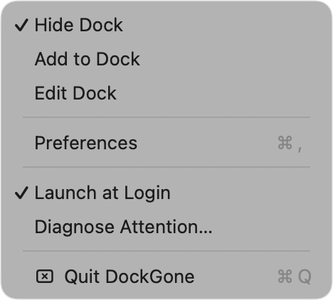
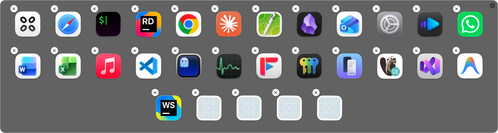
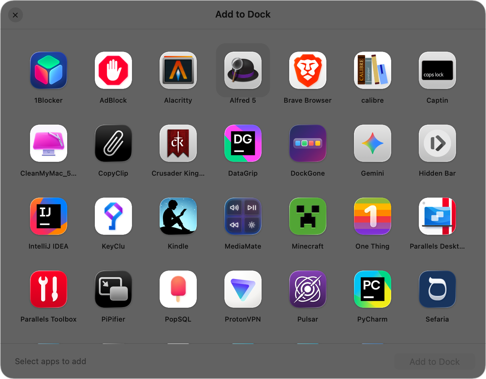
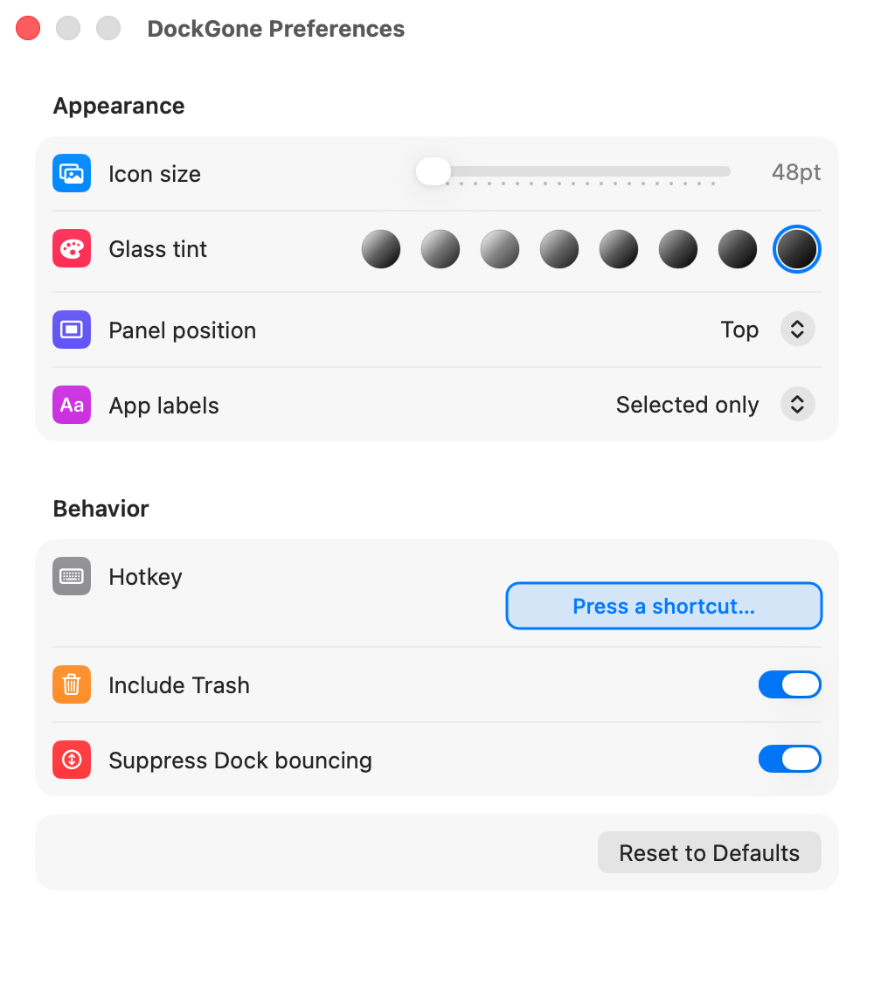

# DockGone

A keyboard-driven launcher for the apps in your Dock that **aren't currently open**. Press ⌥⇥, pick one, release it launches.

> ⚠️ Not a replacement for **⌘⇥** (Command-Tab). ⌘⇥ switches between *running* apps; ⌥⇥ launches ones that *aren't*. They complement each other.

## How it works

Runs as a menu-bar utility (no Dock icon). On hotkey, it reads `~/Library/Preferences/com.apple.dock.plist`, filters out apps that are already running (by bundle ID), and pops up a translucent Liquid Glass switcher with one tile per unopened app.

### Switcher controls

| Action | Result |
|---|---|
| Tap hotkey | Open switcher |
| Tap hotkey again / Shift + hotkey | Cycle forward / back |
| Hold hotkey ≥ 0.35s | Auto-cycle (~5/sec) |
| Arrow keys / hover | Move selection |
| Click icon / release modifier | Launch |
| `Esc`, click outside, or the trailing **✕** tile | Dismiss |

A quick tap-and-release pre-selects the first real app. Panel is a single row when it fits, otherwise wraps to a grid; position is configurable (top/center/bottom).


## Attention tracker

The Dock normally bounces apps that pop up a save-on-quit prompt or other modal dialog, which is useless when the Dock is hidden. DockGone disables the system bounce and replaces it with:

- **Red dot** on the menu-bar icon when one or more inactive apps have a modal prompt waiting.
- **Attention rows** at the top of the menu — click one to bring the app forward (uses `.activateAllWindows`, so the dialog comes to the front even if it was hidden behind another window or on a different Space).


**Detection rule** (deliberately conservative — only "unsaved changes on close" type prompts, never badges or unread counts):

An app is flagged iff it has an `AXSheet`, or an `AXDialog`/`AXSystemDialog` window with `modal=true`, that:
1. Has a visible on-screen frame and at least one button (rules out invisible helper windows),
2. Wasn't already present the first time DockGone observed the app (baseline filter — kills Office's permanent phantom dialogs).

The indicator clears when the app activates, the dialog is dismissed, or the app terminates. There is no public macOS API for "is this app bouncing right now," so DockGone catches the *cause* (the modal prompt) rather than the bounce animation itself.

**Diagnose Attention…** in the menu bar dumps the live AX state of every non-active app to `~/Desktop/dockgone-diag.txt` — useful if the dot ever lights up for the wrong reason.

Toggle **Suppress Dock bouncing** off in Preferences to restore native bouncing.

## Menu bar features

- **Hide Dock** — sets `autohide` with a 9999s delay so it won't slide back in on hover.
- **Add to Dock** — grid picker of every app in `/Applications` and `~/Applications` not already in your Dock. Multi-select to append.
- **Edit Dock** — grid view of current Dock apps. Drag to reorder, click + `Delete` to remove, or click the per-tile **✕** badge (with confirmation). Tiles jiggle in edit mode.
- **Preferences**, **Launch at Login**, **Quit**.



### Edit Dock



### Add to Dock



## Preferences

| Setting | Options | Default |
|---|---|---|
| Icon size | 48–128 pt | 64 pt |
| Glass tint | 8 neutral presets | ~10% black |
| Panel position | Top / Center / Bottom | Center |
| App labels | Selected / Always / Never | Selected |
| Hotkey | Any modifier(s) + key | ⌥⇥ |
| Include Trash | Adds a Trash tile at end | On |

Persisted in `UserDefaults`. Hotkey changes re-register immediately.



## Installation

**Requires macOS 26+** (uses `NSGlassEffectView`).

```bash
git clone https://github.com/quittnet/DockGone.git
cd DockGone
./install.sh
```

Builds release, installs to `~/Applications/DockGone.app` as `LSUIElement`, registers a LaunchAgent. The build isn't codesigned, so Gatekeeper blocks the first launch — right-click → **Open**, or use **System Settings → Privacy & Security → Open Anyway**.

Then grant two permissions:

> **Privacy & Security → Input Monitoring →** add `DockGone.app` *(global hotkey)*
>
> **Privacy & Security → Accessibility →** add `DockGone.app` *(attention tracker, Dock writes)*

### Uninstall

```bash
launchctl unload ~/Library/LaunchAgents/com.user.dockgone.plist
rm ~/Library/LaunchAgents/com.user.dockgone.plist
pkill -x DockGone
rm -rf ~/Applications/DockGone.app
defaults delete com.user.dockgone                                       # preferences (optional)
defaults delete com.apple.dock no-bouncing 2>/dev/null && killall Dock  # restore bouncing
```

Any Dock reorders/deletes you made through DockGone stay — there's no backup. If you used **Hide Dock**, toggle it off first (or `defaults delete com.apple.dock autohide-delay && killall Dock`).

## Architecture notes

- Reads/writes `com.apple.dock.plist` directly, then `killall Dock`. Reorders and adds preserve original plist payloads (badges, display modes); deletes are subtractive.
- Hotkeys via Carbon (`RegisterEventHotKey`) since DockGone runs as `.accessory` and never becomes key.
- Hold-Tab cycling is a 10 Hz poll that watches for modifier release to commit.
- Launch at Login uses a per-user LaunchAgent (not `SMAppService`, which requires signing).

## File layout

```
Sources/DockGone/
├── main.swift               entrypoint, accessory app
├── AppDelegate.swift        menu bar, hotkeys, login item, Hide-Dock toggle
├── SwitcherPanel.swift      switcher panel + per-slot view
├── DockReader.swift         com.apple.dock.plist read / filter / write
├── Settings.swift           Prefs + hotkey display helpers
├── SettingsWindow.swift     SwiftUI preferences pane
├── DockManagePanel.swift    Edit-Dock grid (drag, reorder, delete)
├── AddAppPanel.swift        Add-to-Dock picker
├── AttentionTracker.swift   Modal-dialog detection w/ per-process baseline
└── DiagnoseAttention.swift  Diagnose-Attention menu-item snapshot tool
```
